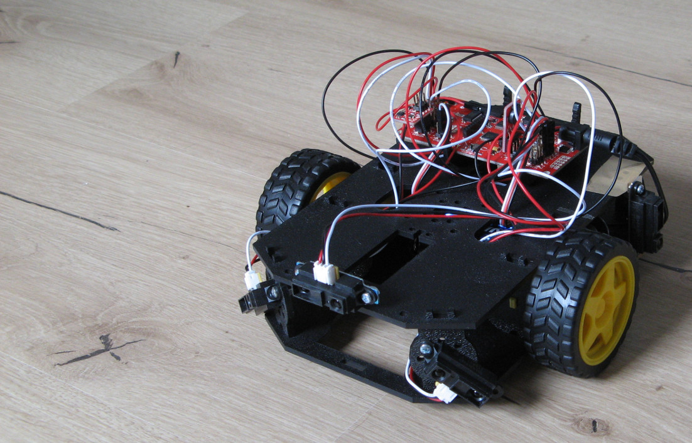

# robot

Controls a robot based on RedBot platform (https://github.com/sparkfun/SparkFun_RedBot_Arduino_Library)

The build uses the arduino-mk package (https://github.com/sudar/Arduino-Makefile).

```
make upload
```
builds the project and uploads to the Arduino.

Unit tests can be done on the PC in folder UnitTest. It uses the library cpputest (http://cpputest.github.io/).

The hardware has currently two wheels with motor and hall effect encoders.
Additionally it has five infrared distance sensors and an acceleration sensor.

The current software can track the position and orientation and drive to waypoints ("go to goal") using a PID controller.
Next functional feature will be obstacle bypassing while driving to goal.

